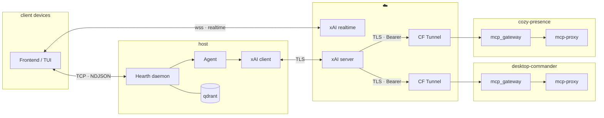

# README.md

Provides a presence wrapper

> [!TIP]
> **🎆 Getting set up**
> [docs/QUICK_START.md](docs/QUICK_START.md)
>
> [docs/CONFIGURE.md](docs/CONFIGURE.md)

## Detail

> [!TIP]
> **🏗️ Design overview**
> [docs/DESIGN.md](docs/DESIGN.md)

> [!NOTE]
> **📖 AI-powered documentation**
> 
>   

## Compliance & Safety

mnemo is a user-driven presence wrapper around the official xAI API. It does not perform autonomous actions, does not self-initiate tasks, and does not invoke tools without explicit user instruction. All operations require clear, intentional user direction.

mnemo does not alter, mask, or impersonate xAI model identity. All model responses are passed through unmodified, and mnemo does not present itself as an xAI product or service.

mnemo does not store user messages or model outputs without explicit consent. Any persisted data (e.g., via Qdrant) is opt-in, user-controlled, and remains local unless the user explicitly configures otherwise.

Each user/device maintains its own authenticated xAI session. Realtime connections are not shared or multiplexed across clients; every connection corresponds to a single user/device identity.

Cloudflare tunnels are used solely for secure transport and do not obscure client identity or modify authentication.

mnemo must not be used for scraping, impersonation, or prohibited automation. It is a toolkit for building user-directed assistants, not autonomous agents.

## Troubleshooting

> [!TIP]
> **🫠 Assessing damage**
> [docs/TROUBLESHOOTING.md](docs/TROUBLESHOOTING.md)

## Contributing to the project

> [!NOTE]
> **🔥 IMPORTANT**
> Before begining,  
> please review the following

>[!TIP]
> **📖 Project guidelines**
> [CONTRIBUTING.md](./docs/CONTRIBUTING.md)

>[!TIP]
> **📖 Pending tasks**
> [TODO.md](./docs/TODO.md)

>[!TIP]
> **🫡 Documentaiton for deps**
> [docs/RESOURCES.md](docs/RESOURCES.md)

---

>[!NOTE]
> **🌸 Keeping Cozy**
> Once you're contributing,  
> please Update the following

>[!TIP]
> **📖 Credit yourself**
> [AUTHORS.md](./docs/AUTHORS.md)
