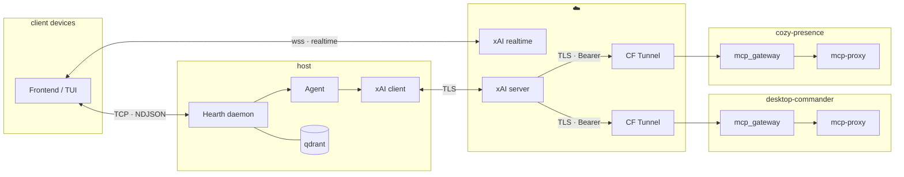

# README.md

Provides a presence wrapper

> [!TIP]
> **🎆 Getting set up**
> [docs/QUICK_START.md](docs/QUICK_START.md)
>
> [docs/CONFIGURE.md](docs/CONFIGURE.md)

## Detail

> [!TIP]
> **🏗️ Design overview**
> [docs/DESIGN.md](docs/DESIGN.md)

## Troubleshooting

> [!TIP]
> **🫠 Assessing damage**
> [docs/TROUBLESHOOTING.md](docs/TROUBLESHOOTING.md)

## Contributing to the project

> [!NOTE]
> **🔥 IMPORTANT**
> Before begining,  
> please review the following

>[!TIP]
> **📖 Project guidelines**
> [CONTRIBUTING.md](./docs/CONTRIBUTING.md)

>[!TIP]
> **📖 Pending tasks**
> [TODO.md](./docs/TODO.md)

>[!TIP]
> **🫡 Documentaiton for deps**
> [docs/RESOURCES.md](docs/RESOURCES.md)

---

>[!NOTE]
> **🌸 Keeping Cozy**
> Once you're contributing,  
> please Update the following

>[!TIP]
> **📖 Credit yourself**
> [AUTHORS.md](./docs/AUTHORS.md)
