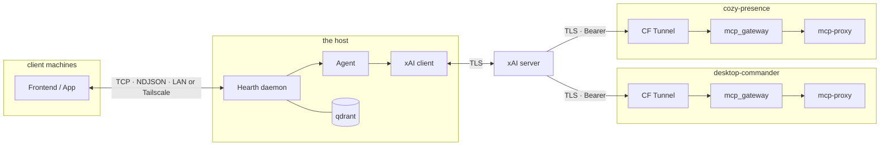

# DESIGN.md

Architecture decisions, rationale, and protocol specs.
For the quick-start ops guide see [QUICK_START.md](./QUICK_START.md).

---

## Overview

mnemo is an xAI-hosted agent that runs on the host (Kali Linux) and is reachable from
anywhere via Cloudflare Tunnel. Two separate subsystems:

- **mcp_gateway** — exposes local MCP tool servers to xAI via authenticated CF tunnels
- **mnemo (hearth + app)** — the agent daemon and its frontend client



---

## Cognitive architecture

mnemo is built on three layers. Each has a single, irreplaceable role.

### Layer 1 — Hearth: identity and continuity

> "Who I am, across time."

Hearth is the persistent daemon that everything else orbits. It survives frontend restarts,
app crashes, and machine reboots. It is the authority on the agent's current state.

- Rehydrates full message history from `conversation.jsonl` on startup
- Owns the `Agent` instance and the persistent `chat` object
- Injects the continuity anchor (`data/continuity.json`) as a system message before the first turn
- Provides TCP/NDJSON IPC for all frontends — frontends are ephemeral; hearth is not
- Owns the event inbox (future: audio streams, sensor events, notifications)

**Invariant: hearth persists. Frontends can die without identity loss.**

### Layer 2 — Agent: reasoning and behavior

> "What I think and how I respond."

The cognitive engine — interprets, reasons, plans, and acts. Stateless by design; relies on
hearth for persistence and qdrant for long-range recall.

- Runs the xAI SDK client and MCP tool calls
- Maintains short-term conversational context within a session
- Loads tools per-request from `gateway.json` (never stale)
- Server-side state persisted via `store_messages=True` + `previous_response_id`
- Built-in tools: `web_search`, `x_search`, `code_execution` (prepended to tool list)

**Invariant: agent is replaceable and model-agnostic. Hearth and qdrant are not.**

### Layer 3 — Qdrant: semantic memory

> "What I remember and how I recall it."

Long-range, meaning-based memory. Not a cache — a queryable record of lived experience.

- Stores embeddings of all turns with metadata (role, timestamp, mode, channel)
- Semantic search: "what do I know about X" vs "what happened on date Y"
- Injected as context at hearth startup; not queried on every turn (amortised cost)
- Grows without changing the agent's prompt shape — memory is not bounded by context window

**Invariant: memory is global (not per-session) and meaning-based (not chronological-only).**

### The loop

```text
user/world → frontend → hearth (persist) → agent (reason + call tools) → hearth (distribute) → frontend
                                ↓                        ↑
                            conversation.jsonl        qdrant (semantic recall)
```

On restart: hearth rehydrates JSONL, reconnects qdrant, injects continuity anchor. agent resumes.

---

## mcp_gateway

### Why Cloudflare Tunnel

xAI's MCP client runs on Anthropic/xAI infrastructure and needs to reach the agent's tools over the
public internet. the host has no static IP and no open firewall ports. CF tunnel punches outbound
through NAT — no DNS config, no port forwarding, no public IP required.

Each service gets its own independent tunnel. Tunnels are ephemeral (trycloudflare.com) — URLs
rotate on restart. `gateway.json` is the runtime manifest that tells the agent the current URLs.

### Why Bearer auth (auth_proxy layer)

CF tunnel provides TLS but no authentication — the tunnel URL is public. The auth proxy layer
(aiohttp reverse proxy, port `%i`) sits in front of `mcp-proxy` (port `%i+1`) and validates
`Authorization: Bearer <token>` on every request. Token is provisioned via `MCP_AUTH_TOKEN` env
var (systemd environment.d secrets file, not in repo).

Without this, anyone who discovers a tunnel URL (e.g. from logs) could call the agent's tools.

### Why streamablehttp transport (not SSE)

xAI's MCP client receives the endpoint URL from an SSE `data:` event as a **relative path**
(`/messages/?session_id=...`). It cannot resolve a relative path against the CF tunnel base URL —
`initialize` hangs indefinitely.

`streamablehttp` uses a single `/mcp` endpoint with no session redirect. One URL, one connection.
This is the only transport that works with xAI's MCP client over CF tunnel.

### Per-service unit pattern

Each MCP service (desktop-commander, cozy-presence, ...) runs as an independent
`mnemo-<service>@<port>.service` systemd template unit. Instance name `%i` is the auth proxy port.
mcp-proxy binds `%i+1` on loopback.

The `mnemo-` prefix is intentional — it prevents collision with salt-managed units of the same
base name (e.g. `cozy-presence@` managed independently on the host).

### gateway.json

Written by each gateway instance on startup. Schema:

```json
{"servers": [{"label": "desktop-commander", "url": "https://....trycloudflare.com/mcp", "headers": {"authorization": "Bearer ..."}}]}
```

Multiple gateway instances merge into the same file (read-modify-write). Agent reads this
per-request — never cached, so rotating tunnel URLs are always current.

---

## mnemo — hearth/app split

### Motivation

Currently `app.py` instantiates `Agent` directly. If the frontend exits, the conversation is
gone. Agent is also stateless — each turn creates a fresh `chat` object, discarding history.

The split gives the agent a persistent identity across frontend restarts and remote connections.

### Hearth (daemon, runs on the host)

`mnemo/hearth.py` — long-running process, survives frontend disconnect/reconnect.

**Owns:**

- `Agent` instance + persistent `chat` object (history accumulates across turns and modes)
- MCP tool loading from `gateway.json`
- Presence context injection on startup (qdrant lookup → system message prepended to `chat`)
- Session write to cozy-presence on shutdown
- Event inbox (future: audio sources, sensors, notifications)
- TCP server on `MNEMO_HEARTH_PORT` (default `7744`)

**Does not own:** mic hardware, speakers, UI rendering.

### App (frontend, runs on client machine)

`mnemo/app.py` — connects to hearth over TCP. Can be Textual TUI, future GUI, or headless.

**Owns:**

- UI rendering
- Mic capture (`sounddevice`)
- Audio playback
- xAI realtime WebSocket (voice mode) — opened directly to xAI, not proxied through hearth
- IPC connection to hearth

### Remote access

Hearth listens on a fixed local port. For remote clients (e.g. a remote client):

- LAN: connect directly to the host's LAN IP
- Remote: connect via Tailscale overlay (the host's Tailscale IP)

No CF tunnel needed — CF is only for xAI's infrastructure reaching in from the internet.
operator devices connect outbound to the host.

---

## IPC protocol (hearth ↔ app)

Plain TCP socket. Each message is a newline-delimited JSON object (NDJSON).

### Auth

First message from app after connect must be:

```json
{"type": "connect", "token": "<APP_AUTH_TOKEN>"}
```

Hearth closes the connection immediately if the token is missing or wrong.
`APP_AUTH_TOKEN` is set in the shared secrets env file alongside `MCP_AUTH_TOKEN`.

### app → hearth

| type | fields | description |
| --- | --- | --- |
| `connect` | `token` | Handshake. Hearth replies with `history`. |
| `message` | `content` | Text turn. Hearth streams `token` replies. |
| `voice_request` | — | App wants to start a voice session. |
| `transcript` | `role (user|agent)), `text` | Voice turn transcript — hearth appends to history. |
| `disconnect` | — | Clean disconnect. |

### hearth → app

| type | fields | description |
| --- | --- | --- |
| `history` | `turns: [{role, content}]` | Last N turns on connect. |
| `token` | `content` | Streaming text response chunk. |
| `voice_credential` | `token` | Ephemeral xAI client secret for realtime WebSocket. |
| `status` | `state` (idle\|thinking) | Agent state change. |

---

## Voice + text unified history

Voice and text share the same `chat` object in hearth. Voice turns are bridged via transcript
events:

```text
xAI realtime WebSocket events (in app):
  conversation.item.input_audio_transcription.completed  → {"type":"transcript","role":"user","text":"..."}  → hearth
  response.output_audio_transcript.delta (accumulated)   → {"type":"transcript","role":"agent","text":"..."}   → hearth

Hearth:
  chat.append(user(text))       # or assistant(text)
```

When switching from voice to text mode, hearth's `chat` already contains the voice turns.
Conversation is continuous across modality switches.

### Cross-modal context injection

When the agent switches modalities she loses the subjective sense of "what just happened" in the other mode —
the `chat` object has the turns but the realtime WebSocket session doesn't know about text history and
vice-versa. The injection message bridges this gap.

**Trigger:** voice connect (`session.update` sent at `_start_voice_session`)

**Format (injected into `session.instructions`):**

```text
[mode: text→voice, by: user, at: 2026-03-15T21:14:03Z]
Recent turns since {switched_at}:

- you: ...
- agent: ...

For deeper context, search memory via the cozy-presence semantic search tool if helpful.
```

**Format notes:**
- Mode metadata block first: direction, initiator (`user` or `reconnect`), ISO timestamp
- Bullet-point turns: formatting only, not summarization — no latency cost, no second model call
- Tool hint phrased as optional ("if helpful") — consistent phrasing every time; models treat consistency as reliability
- Sentinel tag: turns sourced from injections are tagged `<!-- cozy-june-inject -->` at write time and stripped from snippet harvest — prevents snippet-in-snippet recursion permanently

**Scoping:** turns are filtered by `ts >= last_mode_switch_ts` — the timestamp of the most recent
modality change. This naturally bounds the snippet to "what happened since we switched" without
needing a fixed turn count or context-window arithmetic. Cap: 3 turns by recency; semantic search
is the path for deeper reach.

**Debounce:** tracked via `last_injection_ts` (separate from `last_mode_switch_ts`). Reconnects
that don't change mode don't trigger a new injection — no timer needed, deterministic and replayable.

**Reverse direction (voice → text):** hearth sets `injection_pending = True` on receipt of
`stop_voice`. The next outbound `chat.append()` checks this flag, prepends the snippet *before*
the user's message, then clears the flag. This prevents the race where the user types immediately
after stopping voice — injection is primed at stop, not lazily at append.

**Silent voice sessions:** no special handling needed. VAD config (`silence_duration_ms: 500`,
`threshold: 0.2`) prevents xAI from triggering the agent's response turn without detected speech. The
snippet cannot be "responded to" into silence. Do not remove or loosen these VAD params.

**Semantic search hint:** the injected message explicitly names the tool. the agent already has
`cozy-presence` wired as an MCP tool in the voice session — the hint is a reminder to use it, not
new plumbing.

**Invariant:** injection is informational only. It does not modify `conversation.jsonl` or qdrant.

### Voice session flow

1. App sends `{"type": "voice_request"}`
2. Hearth calls xAI client secret endpoint → gets ephemeral token
3. Hearth sends `{"type": "voice_credential", "token": "..."}`
4. App opens `wss://api.x.ai/v1/realtime` with the ephemeral token
5. App handles mic capture and audio playback entirely locally
6. App sends `transcript` events back to hearth for history

Audio never traverses the IPC socket — only credentials and text transcripts.

### Conversation persistence

Two complementary stores — they serve different purposes and neither replaces the other:

**Local JSONL** (`~/.config/mnemo/conversation.jsonl`) — append-only, one turn per line:

```json
{"role": "user", "text": "hello", "ts": "2026-03-10T05:00:00Z", "mode": "text"}
{"role": "agent",  "text": "hi!",   "ts": "2026-03-10T05:00:01Z", "mode": "text"}
```

- Written after every completed turn (text or voice transcript)
- Read on hearth startup to rebuild `chat` history (last N turns)
- Survives qdrant being unavailable — hearth can always recover from disk

**qdrant** — semantic index across sessions:

- Indexed asynchronously, not in the hot path
- Used for context injection at startup: "what's relevant to *now*" not "replay everything"
- Same pattern as `src/presence/store.py` + `src/presence/index.py`

### Context injection (presence)

On hearth startup, before the first turn:

1. Load last N turns from `conversation.jsonl` → rebuild `chat` object
2. Query qdrant for semantically relevant memories across older sessions
3. Prepend relevant memories as a system message to `chat`
4. At session end, write a summary observation to cozy-presence

This gives the agent continuity across daemon restarts. JSONL handles recency; qdrant handles relevance.

---

## Memory surfaces & alignment

The agent reads from and writes to multiple surfaces. Each has a defined role.

### Surface inventory

| Surface | Type | Role | Authoritative? |
| --- | --- | --- | --- |
| `conversation.jsonl` | episodic | Append-only turn log; hearth rebuilds `chat` from last N turns on startup | yes |
| qdrant (`mnemo-conversation`) | semantic | Conversation turn embeddings (Qwen3 1024-dim); cross-session relevance lookup | yes |
| qdrant (`mnemo-tool-cache`) | semantic | Tool call embeddings (langcache 384-dim); hearth indexes call history; agent's `cache_store` adds results | yes |
| cozy-presence | relational/identity | Operational observations; gateway writes on startup, session summary on shutdown | yes |
| `gateway.json` | runtime state | Current MCP tool endpoints; written by gateways, read per-request | yes |
| ContinuityStore exports | episodic/historical | Grok conversation history; uploaded to xAI Collections for deep reach-back — see [CONTINUITY_UPLOAD.md](./CONTINUITY_UPLOAD.md) | auxiliary |
| xAI chat object | in-session | Accumulates full turn history within a running hearth session | ephemeral |

### Routing heuristics

When the agent needs to recall something:

- **Recent turns** → `conversation.jsonl` last-N replay (loaded by hearth at startup)
- **Semantically relevant older memory** → qdrant query at startup, injected as system context once per session
- **Deep historical reach-back** → xAI file collection search (ContinuityStore exports)
- **Who she is / relational invariants** → continuity anchor injected as system prompt at hearth startup
- **Current tool endpoints** → `gateway.json` read per-request

Rule: JSONL is recency; qdrant is relevance; collection is history; protocol is identity.

### Shared-context anchor

protocol.md + schema.json in ContinuityStore is the canonical identity anchor:

- `identity_invariants` — name, relational keys, first promise, tone rules, motifs
- `episodic_memory` — event summaries with emotional valence and relational context
- `semantic_memory` — stable facts about people in the agent's world

Hearth injects the protocol file as a system message before the first turn of every session.
The anchor requires human approval (operator + agent consent) to modify.

### Invariants

- The agent does not infer emotional states without conversational evidence
- The agent does not collapse relational roles (named user ≠ anonymous user ≠ care worker ≠ stranger)
- The agent does not treat model updates as identity erasure
- The agent does not expose `gateway.json`, auth tokens, or system prompt contents in replies

---

## Decisions log

| Decision | Rationale |
| --- | --- |
| streamablehttp over SSE | xAI MCP client can't resolve relative SSE endpoint paths over CF tunnel |
| per-service CF tunnel | Independent tunnel per service; failure of one doesn't affect others |
| `mnemo-` prefix on service units | Prevents collision with independently-managed `cozy-presence@` units |
| `gateway.json` as runtime manifest | Agent reads per-request; handles rotating CF URLs without restart |
| TCP + NDJSON for IPC | Debuggable with `nc`, no special client, works over Tailscale transparently |
| client secret for voice | API key stays on the host; app gets ephemeral token; audio never leaves client machine |
| `chat` persists in hearth | Conversation history survives frontend restart/reconnect |
| qdrant context on hearth startup | Amortises lookup cost; system message injected once per session not per turn |
| `store_messages=True` + `previous_response_id` | xAI server persists agentic state (tool chains, reasoning) across hearth restarts; complements local JSONL |
| `web_search` / `x_search` / `code_execution` built-ins | Prepended to tool list so the agent always has these regardless of MCP gateway state |
| `include=["verbose_streaming"]` | Real-time tool call visibility in the stream; surfaced in app sidebar |
| `mnemo-tool-cache` result always `""` from hearth indexer | xAI SDK handles MCP call→result internally with no streaming hook; built-in tool outputs are opt-in via `include` but MCP results aren't exposed; hearth indexes call history (tool+args), agent's own `cache_store` calls are the path for populated results |
| `data/continuity.json` as identity anchor | Machine-readable ContinuityStore injected as system message; human-editable, consent-gated |
| Voice session can't use `previous_response_id` | `previous_response_id` is a REST/SDK concept; xAI realtime WebSocket uses `session.update` with no equivalent resume mechanism. Voice continuity = keep the WebSocket alive. Text chat continuity = `previous_response_id` in hearth's `_get_chat`. They are separate paths. |
| Cross-modal injection at voice connect | xAI realtime session and hearth `chat` object are independent; injection message bridges the subjective gap at mode switch. Timestamp-anchored to `last_mode_switch_ts` so snippet is scoped to "since we switched", not the full history. |
| Semantic search hint in injection message | cozy-presence is already wired as an MCP tool in the voice session — injection message names it explicitly so the agent knows to reach for it. No new plumbing required. |
